# Agriculture AI Assistant — System Architecture

Status: Draft v1 — for review
Scope: India-first, multi-country-extensible AI farming platform (Android + iOS)
Stack decisions locked in for this draft: **Python/FastAPI** microservices, **Flutter** mobile app, **Google Cloud Platform**

---

## 1. Design Principles

1. **Modular microservices, one capability per service.** Every functional block in the brief (land ID, water resources, soil, weather, crop recommendation, market, disease, pest, fertilizer, irrigation, disaster, schemes, AI advisor, AI chat, satellite monitoring, alerts) is an independently deployable service behind a gateway — not a monolith with feature flags.
2. **Country as a plugin, not a branch.** India is the reference implementation. Every service that touches a government/regional data source (Soil Health Card, APMC, IMD) sits behind a `DataSourceProvider` interface so a new country registers new providers instead of forking code.
3. **Never fabricate data.** Every response carries `confidence_score`, `data_sources[]`, and `assumptions[]`. If live data is unavailable, the service falls back to a modeled/estimated value and marks it `estimated: true` — it never silently substitutes a plausible-looking number.
4. **Farmer-first, admin-second.** The mobile app renders a simplified, actionable view (traffic-light scores, plain-language advice). The same API response carries the full technical payload for an admin/agronomist web console.
5. **Offline-tolerant mobile.** Rural connectivity is unreliable. The app caches the last-known farm report, queues actions (irrigation log, chat questions) and syncs when back online.
6. **Explainable by construction.** Every recommendation-producing service returns `reasoning`, `model_used`, `alternatives[]`, `risk_analysis`, and `action_plan` — see the shared [Recommendation Envelope](#9-standard-output-contract) — rather than a bare number.

---

## 2. High-Level Architecture

```mermaid
flowchart TB
    subgraph Client["Client Layer"]
        MobileApp["Flutter App (Android/iOS)"]
        AdminWeb["Admin/Agronomist Web Console (React)"]
    end

    subgraph Edge["Edge"]
        CDN["Cloud CDN + Cloud Armor (WAF/DDoS)"]
        GW["API Gateway / BFF (FastAPI)\nAuthN, rate limiting, request fan-out, response composition"]
    end

    subgraph Core["Core Domain Microservices (Python/FastAPI, containers on GKE)"]
        LandSvc["Land Identification Service"]
        GeoSvc["GIS / Boundary / Elevation Service"]
        WaterSvc["Water Resource Service"]
        SoilSvc["Soil & Land Health Service"]
        WeatherSvc["Weather Service"]
        CropSvc["Crop Recommendation Engine"]
        MarketSvc["Market Price & Intelligence Service"]
        DiseaseSvc["Disease Prediction Service"]
        PestSvc["Pest Prediction Service"]
        FertSvc["Fertilizer Recommendation Service"]
        IrrigSvc["Irrigation Planning Service"]
        DisasterSvc["Natural Disaster Prediction Service"]
        SchemeSvc["Government Schemes Service"]
        SatSvc["Satellite Monitoring Service (NDVI/stress)"]
        AdvisorSvc["AI Advisor Service (daily/weekly plan)"]
        ChatSvc["AI Chat Service (RAG + LLM)"]
        AlertSvc["Alerts & Notification Service"]
        UserSvc["Farmer Profile & Farm Registry Service"]
    end

    subgraph Data["Data Layer"]
        Postgres["Cloud SQL / AlloyDB\nPostgreSQL + PostGIS\n(farms, boundaries, users, transactions)"]
        Timeseries["BigQuery / TimescaleDB\n(weather, NDVI, price history)"]
        VectorDB["Vector DB (pgvector / Vertex AI Vector Search)\nagronomy knowledge + farm context for RAG"]
        Cache["Memorystore (Redis)\nhot reads, session, rate limits"]
        ObjectStore["Cloud Storage (GCS)\nsatellite tiles, imagery, documents"]
        EventBus["Pub/Sub\nasync jobs: alerts, ingestion, ML batch triggers"]
    end

    subgraph ML["ML/AI Platform"]
        VertexAI["Vertex AI\n(training, batch prediction, model registry)"]
        FeatureStore["Vertex AI Feature Store"]
        LLM["LLM Layer: Claude API (advisor reasoning, chat, summarization)"]
    end

    subgraph External["External Data Sources"]
        GMaps["Google Maps Platform"]
        GEE["Google Earth Engine"]
        Bhuvan["ISRO Bhuvan"]
        Sentinel["Copernicus / Sentinel Hub"]
        NASA["NASA POWER / SMAP / MODIS"]
        OWM["OpenWeather"]
        IMD["IMD / Mausam API"]
        SHC["Soil Health Card (India)"]
        AgriGov["data.gov.in Agriculture APIs"]
        APMC["Agmarknet / APMC"]
        FAO["FAOSTAT"]
    end

    MobileApp --> CDN --> GW
    AdminWeb --> CDN
    GW --> LandSvc & GeoSvc & WaterSvc & SoilSvc & WeatherSvc & CropSvc & MarketSvc
    GW --> DiseaseSvc & PestSvc & FertSvc & IrrigSvc & DisasterSvc & SchemeSvc
    GW --> SatSvc & AdvisorSvc & ChatSvc & AlertSvc & UserSvc

    LandSvc --> GMaps
    GeoSvc --> GMaps & GEE & Bhuvan
    SoilSvc --> SHC & AgriGov & GEE
    WeatherSvc --> OWM & IMD & NASA
    SatSvc --> GEE & Sentinel & Bhuvan
    MarketSvc --> APMC & AgriGov & FAO
    DisasterSvc --> IMD & NASA

    Core --> Postgres
    Core --> Timeseries
    Core --> Cache
    Core --> ObjectStore
    Core --> EventBus
    ChatSvc --> VectorDB
    AdvisorSvc --> VectorDB
    CropSvc & DiseaseSvc & PestSvc & MarketSvc & DisasterSvc --> VertexAI
    ChatSvc & AdvisorSvc --> LLM
    EventBus --> AlertSvc
```



**Why this shape:** each government/satellite data source has different rate limits, auth models, and reliability — isolating them behind dedicated services means an outage in, say, Agmarknet doesn't take down weather or chat. The gateway composes multi-service responses (e.g. the Dashboard needs land health + weather + market + disaster risk in one call) so the mobile app makes one request, not eight.

---

## 3. Microservice Catalog

| Service | Responsibility | Primary external sources | Data store |
|---|---|---|---|
| **User/Farm Registry** | Farmer accounts, farm CRUD, boundary storage, land ID method used | — | Postgres+PostGIS |
| **Land Identification** | Resolve any of the 9 input methods to a canonical farm polygon | Google Maps Geocoding/Places, Survey of India cadastral (state-dependent) | Postgres+PostGIS |
| **GIS/Boundary/Elevation** | Boundary refinement, area calc, elevation, slope, terrain classification | Google Elevation API, GEE (SRTM/DEM), Bhuvan | Postgres+PostGIS, GCS |
| **Water Resource** | Detect nearby rivers/canals/wells/ponds; distance & seasonal availability; groundwater feasibility | GEE (JRC Global Surface Water), India-WRIS, CGWB groundwater API, OSM waterways | Postgres+PostGIS, Timeseries |
| **Soil & Land Health** | Soil properties, fertility, degradation, Land Health Score | Soil Health Card API, SoilGrids, GEE spectral indices | Postgres, Timeseries |
| **Weather** | Historical + forecast (7/30/90d, seasonal, annual), confidence scoring | OpenWeather, IMD, NASA POWER | Timeseries (BigQuery) |
| **Crop Recommendation Engine** | Score & rank short/medium/long-term crops per farm | Internal ML + Soil/Water/Weather/Market services | Postgres, Vertex AI |
| **Market Price & Intelligence** | Price prediction, best market/month, nearby mandis, demand trend | Agmarknet/APMC, data.gov.in, FAOSTAT | Timeseries, Postgres |
| **Disease Prediction** | Crop-specific disease risk + treatment guidance | ICAR/Krishi datasets, weather correlation, curated knowledge base | Postgres, Vector DB |
| **Pest Prediction** | Weather-driven pest risk forecasting | ICAR pest surveillance data, weather | Postgres, Vertex AI |
| **Fertilizer Recommendation** | Org/chemical/bio fertilizer plan, dosage, schedule, cost | Soil Health Service output, ICAR fertilizer norms | Postgres |
| **Irrigation Planning** | Weekly/monthly irrigation schedule, method recommendation | Weather, Soil (water-holding capacity), crop water-need tables (FAO CROPWAT/Penman-Monteith ET₀) | Postgres, Timeseries |
| **Natural Disaster Prediction** | Flood/drought/cyclone/heatwave/hailstorm risk | IMD warnings, NASA, NDMA/SDMA data | Timeseries, Postgres |
| **Government Schemes** | Subsidy/insurance/loan matching + eligibility + application links | data.gov.in, PM-Kisan, PMFBY, state portals | Postgres (curated, periodically refreshed) |
| **Satellite Monitoring** | NDVI, crop stress, water stress, growth stage tracking over time | GEE (Sentinel-2/Landsat), Sentinel Hub | GCS, Timeseries |
| **AI Advisor** | Daily/weekly actionable task list synthesized across all services | Internal services + LLM | Postgres |
| **AI Chat** | Natural-language Q&A grounded in the farmer's own farm data (RAG) | Vector DB + LLM (Claude) | Vector DB |
| **Alerts & Notification** | Push/SMS notification generation and delivery, dedup, quiet hours | FCM, SMS gateway (e.g. Twilio/MSG91) | Postgres, Pub/Sub |

Each service exposes a REST (OpenAPI) contract; internal service-to-service calls go through the gateway's internal mesh (or direct gRPC where latency matters, e.g. Crop Engine → Soil/Weather/Market during a single dashboard build).

---

## 4. Data Layer

| Store | Used for | Why |
|---|---|---|
| **Cloud SQL / AlloyDB (PostgreSQL + PostGIS)** | Farm boundaries, user accounts, transactional/reference data | PostGIS is the standard for polygon storage, spatial joins ("nearest water body"), and area calculations |
| **BigQuery** | Weather history, NDVI time series, market price history, model training sets | Columnar, cheap at scale, native ML (BQML) for quick baseline models, good Vertex AI integration |
| **Vector DB (pgvector to start; Vertex AI Vector Search at scale)** | Agronomy knowledge base + per-farm context embeddings for RAG-grounded chat/advisor | Keeps LLM answers grounded in real agronomy docs + the farmer's own data instead of hallucinating |
| **Memorystore (Redis)** | Session cache, hot dashboard reads, rate limiting, dedup for alerts | Sub-ms reads for the mobile dashboard's common queries |
| **Cloud Storage (GCS)** | Raw satellite tiles, uploaded land documents, generated PDF reports | Cheap object storage, direct GEE/Sentinel export target |
| **Pub/Sub** | Async fan-out: new-farm-registered → trigger soil/water/satellite enrichment jobs; alert events | Decouples slow enrichment pipelines from the synchronous API path |

**Multi-country note:** Postgres schemas use a `country_code` partition key everywhere; BigQuery datasets are sharded per country for query cost isolation; the `DataSourceProvider` interface (§7) means adding a country is a config + provider-implementation exercise, not a data model change.

---

## 5. ML/AI Strategy

### 5.1 Prediction tasks and model approach

| Task | Approach (v1 → mature) | Notes |
|---|---|---|
| Soil property estimation (no lab report) | Regression on satellite spectral indices + SoilGrids prior → fine-tuned model on Soil Health Card ground truth | Always flagged `estimated: true` with a "get a lab test" nudge until a real report exists |
| Land Health Score | Weighted composite (fertility, texture, OC, NPK, pH, erosion risk) → learned model once enough labeled Land Health outcomes exist | Start with an interpretable weighted-sum formula (explainable), replace with gradient-boosted model later |
| Crop suitability/ranking | Rule-based filter (agro-climatic zone, water need vs. availability) + gradient-boosted ranking model (LightGBM) trained on yield outcome data | Rules first for cold-start; ML layer re-ranks as feedback accumulates |
| Market price prediction | Time-series forecasting (Prophet/SARIMA baseline → temporal fusion transformer as data volume grows) | Report a price *range* + confidence, never a single number |
| Disease/pest risk | Weather-driven risk scoring (temp/humidity/rainfall thresholds from agronomy literature) + classifier once image/report data exists | Leaves room for a future computer-vision leaf-disease detector (photo upload) |
| Natural disaster risk | Consume IMD/NDMA warnings directly where available; statistical/historical base-rate model where not | Prefer authoritative government forecasts over in-house prediction for high-stakes events |
| NDVI/crop stress | Direct computation from Sentinel-2 bands (no ML needed) — anomaly detection vs. field/crop-type baseline for stress flags | GEE does the heavy lifting; our service just computes indices and time-series deltas |

All models are versioned in the Vertex AI Model Registry; every prediction response includes `model_used` and `model_version` so a bad prediction can be traced back to a specific model build.

### 5.2 LLM layer (AI Advisor + AI Chat)

- **Pattern: RAG, not fine-tuning.** A vector store holds (a) curated agronomy knowledge (ICAR crop guides, pest/disease handbooks, government scheme text) and (b) the farmer's own structured farm data (serialized to text chunks: latest soil report, weather forecast, crop stage, alerts).
- **Orchestration:** the Chat/Advisor service retrieves top-k relevant chunks, then calls Claude with a system prompt constraining it to answer *only* from retrieved context + the standard output contract (§9), explicitly instructed to say "I don't have reliable data for that" rather than guess.
- **Tool use:** the LLM is given callable tools (`get_weather_forecast`, `get_crop_recommendation`, `get_market_price`) so "Will it rain next week?" triggers a live Weather Service call rather than the model inventing an answer.
- **Local language:** prompts and responses go through a translation layer (Google Cloud Translation or an instruction to the LLM to respond in the farmer's selected language) — critical for adoption across Indian states.

---

## 6. GIS & Satellite Pipeline

1. **Boundary resolution** — whichever of the 9 input methods the farmer uses, it resolves to a `Polygon`/`Point` + resolution confidence (e.g., "GPS + drawn boundary" = high confidence; "village name only" = low confidence, prompts the farmer to refine).
2. **Enrichment pipeline (async, Pub/Sub-triggered on farm creation/edit):**
   - Elevation + slope (GEE DEM)
   - Soil baseline (SoilGrids + Soil Health Card lookup by nearest station)
   - Water body proximity (PostGIS `ST_DWithin` against a pre-ingested water-bodies layer sourced from JRC Global Surface Water + India-WRIS)
   - Initial NDVI baseline (Sentinel-2 via GEE)
3. **Ongoing satellite monitoring** — scheduled Cloud Run job (weekly, aligned to Sentinel-2 revisit time) pulls fresh imagery per active farm polygon, computes NDVI/NDWI/stress indices, diffs against the farm's own trend line, and emits an alert event if it crosses a stress threshold.
4. **Tile serving** — processed imagery/overlays cached in GCS and served to the mobile app via signed URLs or a lightweight tile server, not proxied through the API for every request.

---

## 7. External Data Sources — Mapping to Features

See [DATA_SOURCES.md](./DATA_SOURCES.md) for the full per-feature matrix with auth model, cost tier, rate limits, and fallback strategy.

---

## 8. Multi-Country Extensibility Pattern

```
DataSourceProvider (interface)
 ├── IndiaSoilHealthCardProvider implements SoilDataProvider
 ├── IndiaAgmarknetProvider implements MarketDataProvider
 ├── IndiaIMDProvider implements WeatherAuthorityProvider
 └── <FutureCountry>Provider implements same interfaces
```

- Every service depends on an **interface**, not a vendor SDK, for country-specific data (soil authority, market authority, weather authority, disaster authority, scheme catalog).
- A `country_code` resolved at farm-creation time selects the active provider set via a config registry (no code branching in business logic).
- Global/universal sources (Google Maps, Earth Engine, Sentinel, NASA POWER, FAOSTAT) are shared across all countries and need no per-country provider.
- Crop knowledge base, agro-climatic zone definitions, and units (currency, area units — acres vs. hectares vs. bigha) are also config-driven per country/region.

---

## 9. Standard Output Contract

Every recommendation-producing endpoint returns this envelope (illustrated for crop recommendation; the shape is shared across disease, pest, market, disaster, fertilizer services):

```json
{
  "result": { "...domain-specific fields...": "..." },
  "confidence_score": 0.78,
  "data_sources": [
    {"name": "OpenWeather 90-day forecast", "as_of": "2026-07-15T00:00:00Z", "live": true},
    {"name": "Soil Health Card (nearest station, 4.2km)", "as_of": "2025-11-01", "live": false}
  ],
  "model_used": {"name": "crop-suitability-ranker", "version": "1.3.0"},
  "assumptions": [
    "No farmer-submitted lab soil report; soil properties estimated from satellite spectral index + regional prior.",
    "Water availability assumes borewell functioning at rated capacity."
  ],
  "reasoning": "Ranked above alternatives due to strong soil-moisture match and historically stable Kharif-season pricing for this mandi cluster.",
  "alternatives": [ { "...same shape, lower rank...": "..." } ],
  "risk_analysis": {
    "level": "medium",
    "factors": ["Monsoon onset forecast confidence is moderate (65%) for this district."]
  },
  "action_plan": [
    "Get a lab soil test within 2 weeks to replace estimated NPK values.",
    "Sow within the next 10 days to align with optimal monsoon onset window."
  ]
}
```

This contract is enforced at the API Gateway layer (a shared Pydantic response model), not left to each service to reinvent — any endpoint returning a recommendation without `confidence_score`/`data_sources`/`assumptions` fails contract tests in CI.

---

## 10. Auth, Security, Non-Functional

- **AuthN:** Firebase Authentication (phone OTP — the dominant login pattern for Indian farmers; low literacy assumptions mean OTP > email/password) issuing short-lived JWTs validated at the gateway.
- **AuthZ:** Farm-level ownership checks (a farmer only ever sees their own farms); an `admin`/`agronomist` role for the web console with read access across a region.
- **Secrets:** GCP Secret Manager for all third-party API keys; no keys in mobile app builds — mobile talks only to our gateway.
- **Rate limiting & quota management:** per-farmer and per-service quotas at the gateway to protect metered external APIs (Google Maps, GEE) from runaway cost.
- **Caching strategy:** weather/market/satellite data cached with TTLs matched to source refresh cadence (e.g., NDVI weekly, weather hourly, market daily) to avoid redundant external calls.
- **Observability:** Cloud Logging + Cloud Trace + Cloud Monitoring; every service emits `confidence_score` and `data_source_freshness` as metrics so degraded external data is visible on a dashboard, not just in individual responses.
- **Scalability:** stateless FastAPI services on GKE Autopilot (or Cloud Run for lower-traffic services), horizontal autoscaling on request concurrency; heavy geospatial/ML batch jobs run on Cloud Run Jobs / Dataflow, not inline with API requests.

---

## 11. Mobile App (Flutter)

- **Architecture:** feature-first module structure, `flutter_bloc` (or Riverpod) for state management, `drift`/SQLite for local offline cache of the last-synced farm report.
- **Maps:** `google_maps_flutter` for boundary drawing/GPS pin, with a custom polygon-draw UI for method #9 in the brief.
- **Offline-first dashboard:** last successful API response is cached and rendered with a "last updated" timestamp when offline; actions queue via a local outbox synced on reconnect.
- **Localization:** `flutter_localizations` + ICU message format from day one, even though India-first — Hindi/regional languages are not a "later" concern given the user base.
- **Notifications:** FCM for push (rain alert, disease alert, harvest reminder); deep-links into the relevant dashboard section.

---

## 12. What's Deliberately Deferred

- Land document upload/OCR parsing (explicitly marked "future enhancement" in the brief) — the data model reserves a `land_document` entity but no ingestion pipeline yet.
- Fine-tuned (vs. RAG-grounded) LLM — revisit once there's enough farmer interaction data to justify it.
- Computer-vision leaf-disease detection from photos — the photo-upload infra now exists (`disease_kb` service + mobile Diagnose screen) and RAG-based organic guidance from typed symptoms works today, but automated analysis of the photo itself still needs a vision-capable LLM key that isn't configured. See `docs/architecture/MODULES.md` §9.
- Multi-country data providers beyond India — the interfaces are designed for it now; actual second-country implementation is a future roadmap item.

See [MODULES.md](./MODULES.md) for per-feature functional detail and [ROADMAP.md](./ROADMAP.md) for phasing.
